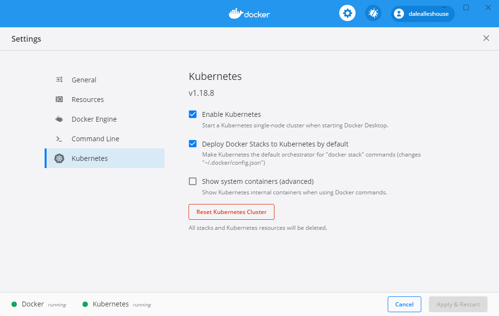

# Zero to DevOps in Under an Hour with Kubernetes 

This repo contains the demo code presented in the Zero to DevOps talk. Slides
available [here](http://slides.com/dalealleshouse/k8)

## Abstract

The benefits of containerization cannot be overstated. Tools like Docker have
made working with containers easy, efficient, and even enjoyable. However,
management at scale is still a considerable task. That's why there's Kubernetes
(K8S).  Come see how easy it is to create a manageable container environment.
Live on stage (demo gods willing), you'll witness a full K8S configuration. In
less than an hour, we'll build an environment capable of: Automatic Binpacking,
Instant Scalability, Self-healing, Rolling Deployments, and Service
Discovery/Load Balancing.

## Demo System

The image below outlines the system we are going to host on K8S.


The demo system consists of five separate applications that work together.

1. NGINX serves a static HTML file to a browser
1. ASP.NET Core REST API accepts requests from the browser and returns queue
   stats
1. RabbitMQ is configured as a standard work queue
1. Ruby Producer pushes a message with a random number on the queue every
   second
1. Java Consumer pulls messages from the queue one at a time and generates
   Fibonacci numbers in order to simulate CPU bound work

## Prerequisites

All of the following software must be installed in order to run this demo.

1) [Git](https://git-scm.com/book/en/v2/Getting-Started-Installing-Git)
1) [Docker](https://www.docker.com/community-edition)
1) [kubectl](https://kubernetes.io/docs/tasks/kubectl/install/)

## Clone the Repo

Although it most likely goes without saying, the first thing you need to do is
clone this repo.

``` bash
git clone https://github.com/dalealleshouse/zero-to-devops.git
```

## Kubernetes Cluster

In order to run the demo, you must have a working K8S cluster. Creating a
cluster is easy with all three of the major cloud providers.

- [Google Cloud](https://cloud.google.com/container-engine/docs/quickstart)
- [Azure](https://docs.microsoft.com/en-us/azure/aks/kubernetes-walkthrough)
- [Amazon](https://aws.amazon.com/kubernetes/)

There are also many [other
options](https://kubernetes.io/docs/getting-started-guides/) for running
virtually anywhere, including on premise. This demo utilizes [Docker
Desktop](./https://www.docker.com/products/docker-desktop) which comes with a
built-in k8 cluster. To enable it, simple select the "Enable Kubernetes" options
as pictured below.



Although this demo will run in other cluster environments, there will be minor
configuration changes. These instructions apply specifically to Docker Desktop.

## Ingress

This demo employs an [ingress](https://kubernetes.io/docs/user-guide/ingress/)
to route incoming cluster traffic to desired K8S services. The terms *service*
and *pod* are used frequently.  Don't worry if you don't understand these
concepts yet, they are covered below.

An ingress is a set of rules that allow inbound connections to reach K8S
services. In K8S, an ingress has two components: an ingress resource and an
ingress controller. An ingress resource is a K8S object that defines routing
rules. The one used for this demo is located [here](/kube/ingress.yml). An
ingress controller is a daemon that runs as a K8S pod (similar to a container).
It is responsible for watching the ingress resource and satisfying requests to
the ingress. In short, it's special load balancer.

This demo utilizes an
[nginx](https://kubernetes.github.io/ingress-nginx/deploy/) ingress. It's
configured using the following command:

``` bash
kubectl apply -f \
    https://raw.githubusercontent.com/kubernetes/ingress-nginx/controller-v0.40.2/deploy/static/provider/cloud/deploy.yaml
```

Next, create the K8S ingress resource. Assuming you are in this project's root
directory, run the following command.

``` bash
kubectl create -f kube/ingress.yml
```

Barring any errors, the command below should display information about the
ingress you just created.

```
kubectl describe ing
```

The astute reader will notice that the ingress rules are routing traffic from
demo.com and status.demo.com. For demo purposes, we are going to update our
hosts file to map those domains to the localhost. Add the entries below to your
hosts file. Make sure to use the IP address from the above command. In case you
need it, here are instructing for updating the hosts file on windows and mac.

```
127.0.0.1 demo.com
127.0.0.1 status.demo.com
```

Make sure to remove these after the demo in case you ever want to visit the
actual demo.com website.

## Image Registry

Using an external Docker registry isn't a viable option for this demo because
internet access isn't guaranteed. It is possible to create a [local docker
registry](https://docs.docker.com/registry/deploying/) but the complexity
surrounding security distracts from the purpose.  Therefore, we are going to
manually build (in advance) the demo container.  During the on stage
demonstration, the containers will be available locally.  Therefore, K8S will
not attempt to download them. Navigate to the project directory and run the
commands below.

``` bash
docker build --tag=html-frontend:1.0 html-frontend/
docker build --tag=html-frontend:2.0 html-frontend-err/
docker build --tag=java-consumer:1.0 java-consumer/ 
docker build --tag=ruby-producer:1.0 ruby-producer/
docker build --tag=status-api:1.0 status-api/
docker pull rabbitmq:3.6.6-management
```
   
## Deployments

The K8S [*Pod*](https://kubernetes.io/docs/user-guide/pods/) object represents
a group of one or more containers that act as a single logical unit. The demo
consists of five individual containers that act autonomously so each *Pod* has
a single container.

``` bash
kubectl run html-frontend --image=html-frontend:1.0 --port=80 --env STATUS_HOST=status.demo.com
kubectl run java-consumer --image=java-consumer:1.0
kubectl run ruby-producer --image=ruby-producer:1.0
kubectl run status-api --image=status-api:1.0 port=5000
kubectl run queue --image=rabbitmq:3.6.6-management
```

Verify the objects were created correctly with the following command.

``` bash
kubectl get pods
```

Each pod represents a container running on the K8S cluster.  kubectl mirrors
several Docker commands. For instance, you can obtain direct access to a pod
with exec or view stdout using log.

``` bash
kubectl exec -it *POD_NAME* -- bash
kubectl logs *POD_NAME*
```

## Services

Viewing the logs of the ruby producer reveals that it unable to connect to the
queue. Each pod has an IP address that is reachable inside the K8S cluster. One
could simply determine the IP address of the queue and update the ruby
producer. However, the address is ephemeral.  If the pod dies and is
regenerated the IP address will change. K8S services provide a durable endpoint
for pods. The command below creates a *Cluster IP* service and exposes ports
for the queue pod.

``` bash
kubectl expose pod queue --port=15672,5672 --name=queue
```

It may take a minute or two, but inspecting the logs from the ruby producer pod
should show that the service is now sending messages to the queue. *Cluster IP*
services enable inner-cluster communication.

Applications running in K8S are firewalled from external traffic by default.
This includes *Cluster IP* services.  In order to expose pods externally, it is
necessary to create either a *Node Port* or *Load Balancer* service.  As the
names imply, a *Node Port* service connects a port on the cluster to a pod and
a *Load Balancer* service connects an external load balancer to a pod. Most
cloud providers offer a convenient means of creating *Load Balancer* services.
However, this isn't an option with Minikube. Therefore, the demo employs *Node
Port* services.

The commands below create *Node Port* services for the NGINX and REST API pods. 

``` bash
kubectl expose pod html-frontend --port=80 --name=html-frontend --type=NodePort
kubectl expose pod status-api --port=80 --target-port=5000 --name=status-api --type=NodePort
```

To ensure the services were created correctly, run the command below.

``` bash
kubectl get services
```
As a side note, the command above reveals a service that we didn't create named
kubernetes. This is used for communication with the core API. It is possible to
consume this REST API without going through kubectl. In fact, there are a few
[client
libraries](https://github.com/kubernetes/community/blob/master/contributors/devel/client-libraries.md)
readily available. This is beyond the scope of the demo, but more information
is available
[here](https://kubernetes.io/docs/concepts/overview/kubernetes-api/).

If everything is configured correctly, navigating to demo.com will display the
page served up from the NGINX pod.

## Infrastructure as Code

Although the object creation commands introduced above are sufficient, there
are many advantages to storing infrastructure as code. Keeping system
configuration in source control makes it easy to examine and allows for instant
regeneration on different hardware. Additionally, it affords the ability to
view changes over time.  There is no down side to it. K8S supports
creating/removing/altering objects from yaml files. All the deployments and
services for this demo are in the kube project folder.

To delete every object from the demo, use the following command:

``` bash
kubectl delete pod --all
kubectl delete -f ./kube/
```

It's easy to recreate everything with the following command:

``` bash
kubectl create -f ./kube/
```

The commands above also work for individual files. A single object is updated
with the following command:

``` bash
kubectl replace -f ./kube/html-frontend.dply.yml
```

Configuration files stored in source control is the recommended way to work with
K8S.

## Dashboard/Monitoring
The K8s [dashboard](https://github.com/kubernetes/dashboard) is a decent freely
available monitoring tool. Installation is trivial, simply run the following
command:

``` bash
kubectl apply -f https://raw.githubusercontent.com/kubernetes/dashboard/v2.0.4/aio/deploy/recommended.yaml
```

Before using it, you will need to create a user. For convince, this project has
a admin user yml definition file located [here](./kube/admin_user.yml). Use the
following command to create the user.

``` bash
kubectl create -f kube/user/admin_user.yml
```

To access the dashboard locally, you will need to tunnel traffic using the
following command:

```bash
kubctl proxy
```

The dashboard should be available at this address:
<http://localhost:8001/api/v1/namespaces/kubernetes-dashboard/services/https:kubernetes-dashboard:/proxy/>

You will need a temporary access token to access the dashboard. Generate one
using the following command:

``` bash
kubectl -n kubernetes-dashboard describe secret $(kubectl -n kubernetes-dashboard get secret | grep admin-user | awk '{print $1}')
```

## Scaling
Increasing the number of pod replicas on a deployment is as easy as running the
command below.

``` bash
kubectl scale deployment html-frontend --replicas=3
```

Running this command reveals that the three requested replicas are already up
and running.

``` bash
kubectl get pods -l run=html-frontend
```

After the service has time to register the change, it will automatically round
robin load balance requests to the replicas. Notice the name of the pod on the
web page changes for every subsequent request.

The ability to manually scale pods quickly is great; however, K8S has an even
better option. It's possible to scale in response to load. The command below
tells K8S to maintain between 1 and 5 replicas based on fifty percent CPU
usage. This means if the allocated CPU for the all pods goes above 50%, new
replicas will be added. If it goes below 50%, replicas are removed. Most
details on the auto scaling algorithm can be found
[here](https://github.com/kubernetes/community/blob/master/contributors/design-proposals/horizontal-pod-autoscaler.md)

There is a bug in the auto scaler for Docker Desktop. Use the following commands
as a workaround:
``` bash
kubectl delete -n kube-system deployments.apps metrics-server
kubectl apply -f ./kube/metrics-server/components.yaml
```

``` bash
kubectl autoscale deployment java-consumer --min=1 --max=5 --cpu-percent=50
```

After running the command above, notice that the number of java-consumer
replicas slowly climbs. As of the 1.5 release, CPU is the only metric available
to scale on. However, there are plans to add more in upcoming releases.

The autoscale command creates a *Horizontal Pod Scaling* resource. Just like
any other K8S resource, it can be manipulated via a yaml file. The following
commands display information about the resource.

``` bash
kubectl get hpa
kubectl describe hpa
kubectl get hpa -o yaml
```

## Self Healing

Replica controllers automatically add new pods when scaling up.  Likewise, they
generate a new pod when one goes down. See the commands below.

``` bash
# View the html-frontend pods
docker ps -f label=io.kubernetes.container.name=html-frontend

# Forcibly shut down container to simulate a node\pod failure
docker rm -f *CONTAINER*

# Containers are regenerated immediately
docker ps -f label=io.kubernetes.container.name=html-frontend
```

Of course, it's not very often that a container just completely shuts down.
That's why K8S provides liveness and readiness checks. Look at the bottom
section of the [html-frontend deployment file](/kube/html-frontend.dply.yml).
The section of interest is shown below.

``` yaml
...
        livenessProbe:
          httpGet:
            path: /healthz.html
            port: 80
          initialDelaySeconds: 3
          periodSeconds: 2
        readinessProbe:
          httpGet:
            path: /healthz.html
            port: 80
          initialDelaySeconds: 3
          periodSeconds: 2
```

This tells K8S to request healthz.html every 2 seconds and restart the pod upon
a bad request. The following commands simulate such a failure.

```
kubectl get pods
kubectl exec *POD_NAME* -- rm usr/share/nginx/html/healthz.html
```

Running `kubectl get pods` again should produce an output similar to below:

``` bash
NAME                             READY     STATUS    RESTARTS   AGE
html-frontend-1306390030-t1sqx   1/1       Running   1          12m
...
```

Notice the pod is question has one restart. Likewise, navigating to the
replication controller via the dashboard or, running `kubectl describe
*POD_NAME*` will reveal a *Liveness Probe Failed* event. When the health check
failed, K8S automatically killed the old container and stood a new one up.
Likewise, if a readiness probe were to fail the pod would never be brought
online which would stop any rolling updates in progress.

## Rolling Deployment/Rollback

When K8S updates a deployment, it pulls one pod out of the system at a time,
updates it, and waits till it's up before moving on to the next.  This ensures
that users never experience an outage. The following command will update the
html-frontend deployment container image.

``` bash
kubectl set image deployment/html-frontend html-frontend=html-frontend:2.0
kubectl get deployments 
```

The output of the last command shows that the update was made almost instantly.
Navigating to demo.com should show a significant error. Obviously, the 2.0
image is flawed. Luckily, with K8S it's rolling back to the previous images is
as easy as the following command:

``` bash
kubectl rollout undo deployment html-frontend
```

There are a few different options for rollbacks. The following commands display
the roll out history of a deployment.  Putting a *--revision=#* after the
*rollout undo* command will roll back to specific version.

``` bash
kubectl rollout history deployment html-frontend
kubectl rollout history deployment html-frontend --revision=*REVISION_NUMBER*
```

## Other Cool Stuff

- [Secrets](https://kubernetes.io/docs/concepts/configuration/secret/)
- [Volumes](https://kubernetes.io/docs/concepts/storage/volumes/)
- [Stateful Sets](https://kubernetes.io/docs/concepts/workloads/controllers/statefulset/)
- [Daemon Sets](https://kubernetes.io/docs/concepts/workloads/controllers/daemonset/)
- [Jobs](https://kubernetes.io/docs/concepts/jobs/run-to-completion-finite-workloads/)
- [Cron Jobs](https://kubernetes.io/docs/user-guide/cron-jobs/)
- [So Much More](https://kubernetes.io/docs/home/)
